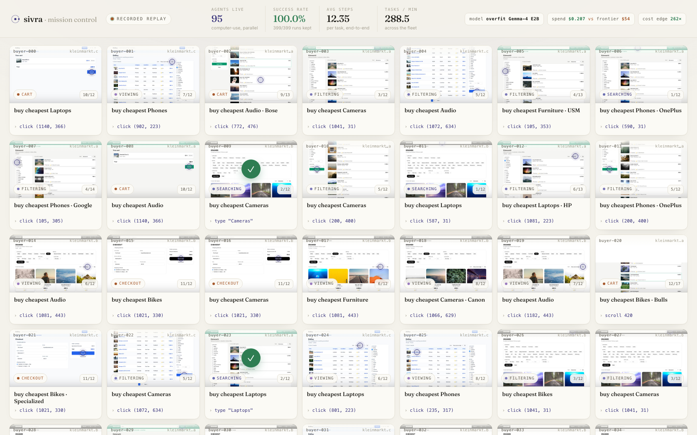

# sivra · mission control

The hero visual for the demo: a live control-room grid of **~100 buyer agents
operating the marketplace in parallel**. Each tile is one computer-use agent
working a shopping task — a screenshot that advances through the steps, the
current action, the task goal, a status badge, a step counter, and a green flash
on success. A top bar shows aggregate fleet stats and a cost contrast vs a
frontier API.

It reads as *"a swarm of agents shopping in parallel"* — because the footage is
**genuine recorded computer-use runs**, replayed. Zero live infra required, but a
real fleet can be plugged in via one documented HTTP hook (see below).



## What's on screen

- **Grid** — up to ~100 agent tiles. Each tile cycles through one recorded
  trajectory's screenshots + actions (search → filter → view → cart → checkout →
  `done ✓`), then the slot picks up the next task, like a worker pool draining a
  queue. Tiles are staggered so the grid is always in motion at different steps.
  A faint cursor dot marks the next click target on the screenshot.
- **Action line** — rendered like `click (412, 233)` / `type "road bike 56"` /
  `scroll` / `done ✓`.
- **Status badge** — derived from the action sequence:
  `searching → filtering → viewing → cart → checkout → done`, colour-coded.
- **Top bar** — agents live, success rate (the **real** corpus number), avg steps,
  tasks/min, plus `model: overfit Gemma-4 E2B` and a **spend vs frontier** cost
  contrast (`$0.21` vs `$54`, ~260× edge).

## The numbers are real

Computed from the 399 recorded runs in `data/datasets/buyer/`:

| metric            | value                                   |
|-------------------|-----------------------------------------|
| trajectories kept | 399 / 400 attempted                     |
| success rate      | **100.0%** of kept runs (99.75% of attempts) |
| avg steps / task  | **12.35**                               |
| total steps       | 4,926                                   |
| sites             | 3 (`site-a/b/c`)                        |
| categories        | 6 (Phones, Cameras, Furniture, Laptops, Bikes, Audio) |

## Architecture

```
mission_control/
├── app.py            FastAPI: /, /api/fleet (live hook), /shots/*, /health
├── ui.py             the single dashboard page (sivra design language) + vanilla-JS poll loop
├── prep_data.py      offline: bundles a 60-trajectory subset, downscales shots → JPEG, writes the manifest
├── fleet.json        compact replay manifest (steps + derived status/action labels + corpus stats)
│                     (kept at service root — the repo-root .railwayignore excludes any data/ dir)
├── static/
│   └── shots/        ~735 downscaled 640px JPEG screenshots (~17 MB) — the bundled subset
├── requirements.txt  fastapi, uvicorn, httpx, python-dotenv
├── Dockerfile        python:3.12-slim, copies app + data + static
├── railway.json      Railway Dockerfile builder + start command
└── .dockerignore / .railwayignore
```

The 1 GB source corpus (`../data/datasets/buyer/`) is read **read-only at prep
time only**; the running container ships just the bundled subset, so the deploy
is lean and has no dependency on the source data or any live infra.

## The live-data hook — `GET /api/fleet`

This is the seam for the runtime team: the page renders entirely from this
endpoint, and a real fleet can push live agents in by serving the **same shape**.

```
GET /api/fleet?n=100         # n = how many tiles (1..200, default 100)
GET /api/fleet?n=100&replay=1  # force the recorded replay even if an upstream is set
```

**Response shape** (today synthesized from the recorded runs; identical when live):

```jsonc
{
  "agents": [
    {
      "agent_id":       "buyer-007",              // stable id per tile/slot
      "site":           "kleinmarkt.b",           // which marketplace
      "screenshot_url": "/shots/<ep>_<step>.jpg", // current frame (any URL the browser can load)
      "action":         "click (412, 233)",       // human-readable current action
      "goal":           "buy cheapest Phones · OnePlus",
      "category":       "Phones",
      "status":         "filtering",              // searching|filtering|viewing|cart|checkout|done
      "step":           4,                          // 1-based step in this run
      "n_steps":        12,                         // total steps in this run
      "reward":         null,                       // scalar reward, set on the 'done' frame
      "success":        true
    }
    // … up to n agents
  ],
  "stats": {
    "active": 87, "total_tiles": 100, "done_now": 13,
    "success_rate": 1.0, "corpus_trajectories": 399, "corpus_success": 399,
    "avg_steps": 12.35, "total_steps": 4926, "tasks_per_min": 264.2,
    "model": "overfit Gemma-4 E2B",
    "cost_ours": 0.207, "cost_frontier": 54.19, "cost_ratio": 262
  },
  "source": "replay"   // "replay" | "live"
}
```

Minimum a live producer must return per agent: `agent_id`, `site`,
`screenshot_url`, `action`, `goal`, `status`, `step`, `n_steps`. `reward` /
`success` are used for the success flash and the top-bar gauges.

### Going live (one env var)

Set `FLEET_UPSTREAM` to a base URL whose `GET /api/fleet?n=…` returns the shape
above. This service then **proxies** it and only falls back to the recorded
replay on error (so the slide never goes blank):

```bash
railway variables --service mission-control --set "FLEET_UPSTREAM=https://your-runtime.example" --skip-deploys
```

The front-end flips the indicator from `recorded replay` → `live fleet`
automatically based on `source`.

### Other env vars (all optional)

| var | default | purpose |
|-----|---------|---------|
| `FLEET_UPSTREAM` | _(unset)_ | live fleet base URL; unset ⇒ recorded replay |
| `FLEET_SIZE` | `100` | default tile count |
| `TICK_SECONDS` | `1.6` | wall-clock seconds per replay step |
| `COST_OURS_PER_STEP` | `0.000042` | $/step for our model (cost contrast) |
| `COST_FRONTIER_PER_STEP` | `0.011` | $/step for a frontier computer-use API |

## Local dev

```bash
python3.12 -m venv .venv && .venv/bin/pip install -r requirements.txt pillow
# (re)build the bundled subset from the recorded corpus — needs ../data/datasets/buyer
.venv/bin/python prep_data.py --n 60 --width 640 --quality 72
.venv/bin/uvicorn app:app --host 0.0.0.0 --port 8911
# open http://127.0.0.1:8911/
```

## Live deployment (project "believable-comfort")

- **Service:** `mission-control` (new service, alongside `supervisor` / `voice` / `console`)
- **URL:** **https://mission-control-production-332c.up.railway.app**
- **Health:** `GET /health` → `{"ok":true,"bundled_trajectories":60,"shots":735,...}`
- **Fleet API:** `GET /api/fleet?n=100`

### Deploy / redeploy

```bash
export RAILWAY_TOKEN=$(grep '^RAILWAY_API_KEY=' ../.env | cut -d= -f2-)   # project token
railway up --service mission-control --detach
railway domain --service mission-control      # the *.up.railway.app URL
```

> Note: `RAILWAY_API_KEY` in `../.env` is a **project-scoped** token. It authorizes
> project-scoped commands (`up`, `variables`, `domain`) but NOT account-scoped
> ones (`whoami`, `link`) and it **cannot bind custom domains** — we ship the
> generated `*.up.railway.app` URL.
